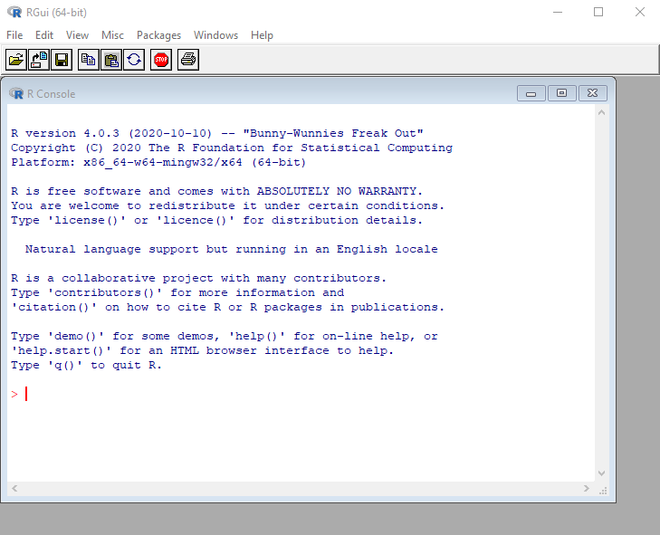
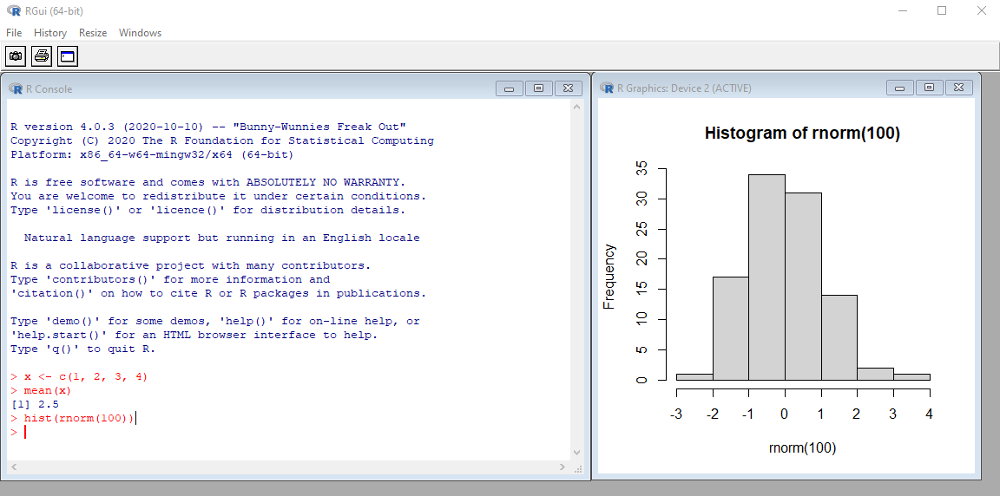

class: inverse, center, middle
# Introduction to R

---
# Hello, R

<p align="left"></p>

.large[
R is a free, open-source software environment for statistical computing and graphics maintained by an international team of developers.

Because R is free, many of the functions you may wish to use will be contributed by other users as packages and available through repositories such as CRAN, GitHub, or Bioconductor, among others. 

It is your responsibility to vet the quality and accuracy of any user-contributed packages.

The functions available with the initial installation of R, known as base R, can be considered trustworthy.
]

---
# Installing R

(Skip to [Open R and take a look](#open-r) if everyone already has R installed)

.large[
1. Go to the website for [The Comprehensive R Archive Network](https://cran.r-project.org/). 
2. The top of the web page provides three links for downloading R. Follow the link that describes your operating system: Windows, Mac, or Linux.

We will focus on installation for Windows and Mac. 

If you use any of the Linux servers, like the HPC, available at Cleveland Clinic, R should already be installed or you can work with the appropriate IT department to install R or any needed packages. ]

---
# Installing R on Windows

.large[
To install R on Windows:
1. Click the “Download R for Windows” link.
2. Click the “base” link.
3. Click the first link at the top of the new page. This link should say something like “Download R 4.2.0 for Windows,” except the "4.2.0" will be replaced by the most current version of R. The link downloads an installer program, which installs the most up-to-date version of R for Windows. 
4. Run this program and step through the installation wizard that appears. The wizard will install R into your program files folders and place a shortcut in your Start menu. The defaults should be acceptable for most.
]


---
# Installing R on Mac

.large[
To install R on a Mac:
1. Click the “Download R for (Mac) OS X” link. 
2. Click on the "R-4.2.0.pkg" package link. The "4.2.0" will be replaced by the most current version of R. An installer will download to guide you through the installation process.
3. Run this program, which lets you customize your installation, but the defaults will be suitable for most users.
]

---
name: open-r
# Open R and take a look

.large[
The R Graphical User Interface (Gui) will contain a window labeled R Console. 
]

<p align="center"></p>

---
# Interactive R demo

```{r eval = FALSE}
x <- c(1, 2, 3, 4)
mean(x)
hist(rnorm(100))
```

.large[
You can type code directly into the console and get results.

A separate window pops up for graphics.

***Note: you can save the R session but you cannot save the raw source code.*** 
]

---
# Interactive R demo results

<p align="center"></p>