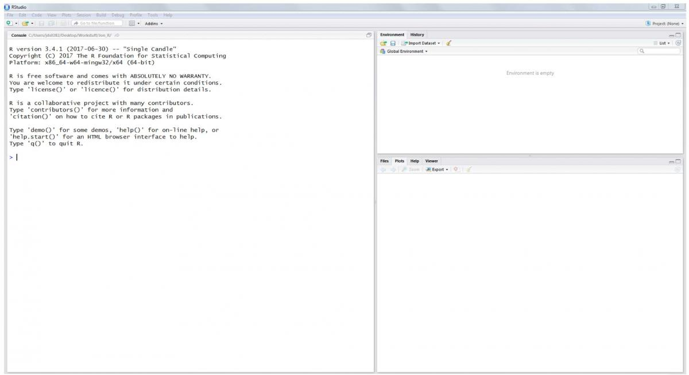
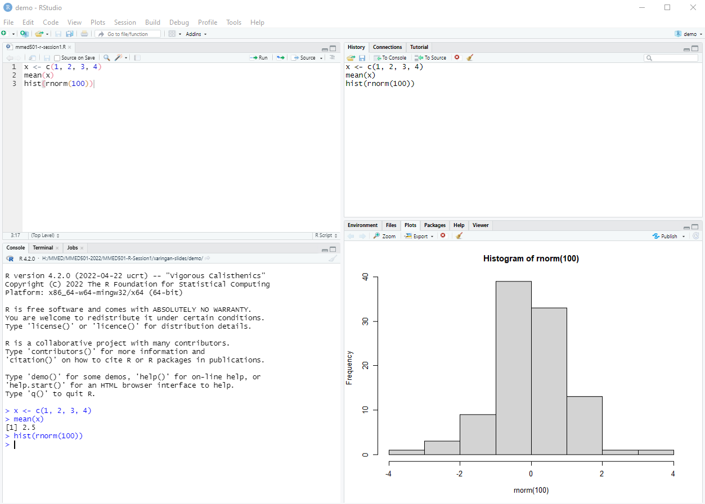

class: inverse, center, middle
# Introduction to RStudio

---
# Hello, RStudio

<p align="left"></p>

.large[
RStudio is an Integrated Development Environment (IDE).

It runs R and allows users to develop and edit programs and offers higher quality graphics and a more user-friendly interface.

***Note: RStudio is not a standalone program, you must have a separate installation of R***
]

---
# Installing RStudio

(Skip to [Open RStudio and take a look](#open-rstudio) if everyone already has RStudio installed)

.large[
1. Go to the website for [RStudio](https://www.rstudio.com/products/rstudio/)
2. Select "RStudio Desktop"
3. Click the button for "Download RStudio Desktop"
4. Select the Free version to download. 
5. An installer will download and provide simple instructions to follow.
]

---
name: open-rstudio
# Open RStudio and take a look

.large[When you first open RStudio you will see a number of panes:]

<p align="center"></p>


---
# Using the text editor in RStudio

.large[
Always use a text editor to type code so that it can be saved for reproducibility purposes.

How to open a text editor window:

1. Go to File > New File > R script

2. Go to File > Save and save this somewhere convenient for you with your other class materials with the filename "mmed501-r-session1.R"
]

---
# Interactive RStudio demo

```{r eval = FALSE}
x <- c(1, 2, 3, 4)
mean(x)
hist(rnorm(100))
```

.large[
To send this to the console to be executed, you can do one of the following:

1. Place your cursor next to the line you want to run and hit Ctrl+Enter on your keyboard
2. Place your cursor next to the line you want to run and hit the "Run" button
3. Highlight all three lines of code and use one of the previous options
]


---
# Interactive RStudio demo results

<p align="center"></p>


---
# View the output

.large[
After we have run all three lines of code, we see the results of our mean computation in the Console pane. 

And we see the resulting histogram in the Plots pane.

But how would we get these results out of RStudio to turn in for homework or share with collaborators? 

This is where **R Markdown** comes in handy.
]


