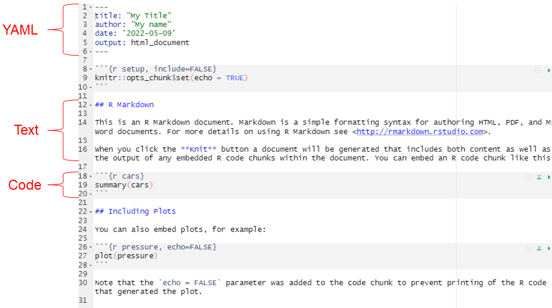
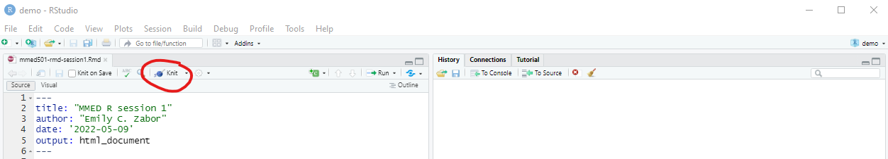
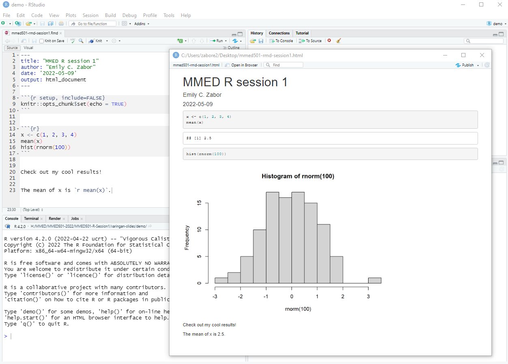

class: inverse, center, middle
# Introduction to R Markdown 


---
# Hello, R Markdown

<p align="left"></p>

.large[
One of the benefits of RStudio is seamless integration of R Markdown.

R Markdown is a file format that allows you to integrate text using **markdown** syntax with dynamic **code chunks**.
]

---
# Create a new R Markdown file

.large[
1. Go to File > New File > R Markdown...
2. You will see options to create a Document, Presentation, Shiny, or From Template. The most common choice is to create a Document. 
3. Type "MMED501 R session 1" in the Title box and type your name in the Author box. 
4. Select the radio button for HTML under "Default Output Format" 
5. Click OK.
6. A new file will open with .Rmd as the file extension. Go to File > Save and save this in the same location as the previous .R file we saved, with the filename "mmed501-rmd-session1.Rmd" (**Note that the file needs to be saved before you can execute it**)
]
 
 
---
# Anatomy of an R Markdown file

<p align="center"></p>


---
# Interactive R Markdown demo - code

.large[
Let's delete out the default text, leaving the top R chunk. 

This R chunk is saying that we want our code to print to file in addition to the results.

To suppress code and only show the results of code, you can change this from `knitr::opts_chunk$set(echo = TRUE)` to `knitr::opts_chunk$set(echo = FALSE)`.

Now return two lines and go to Insert > R to insert a new R code chunk, and add the following code:
]

```{r eval = FALSE}
x <- c(1, 2, 3, 4)
mean(x)
hist(rnorm(100))
```


---
# Interactive R Markdown demo - text

.large[
Now return two lines and type some text that you want to print to file, like "Check out my cool results!"

You can also execute R code inline instead of in an R chunk by using `` `r knitr::inline_expr("expression")` ``, where expression is replaced by the code you want to evaluate.

Return another two lines and type "The mean of x is `` `r knitr::inline_expr("mean(x)")` ``."
]

---
# Interactive R Markdown demo - knit

.large[Now, to generate the output, we can simply hit "Knit". ]

<p align="left"></p>

.large[
A new window will pop up with the html output of your program. You will also have an HTML (or whatever Document format you selected) file saved in the same location and with the same name as your R Markdown file. 

In this way you can create reproducible reports for all of your projects.

Read more here: [https://bookdown.org/yihui/rmarkdown/](https://bookdown.org/yihui/rmarkdown/)
]

---
# Interactive R Markdown demo results

<p align="center"></p>
