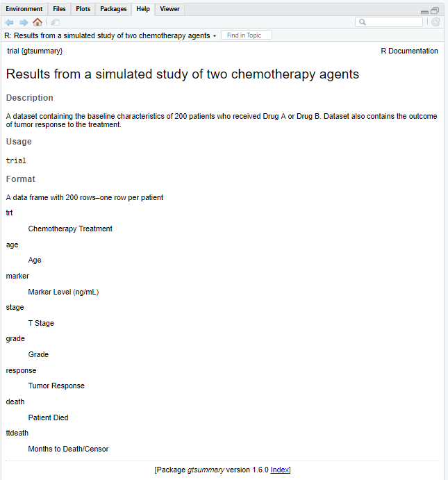

class: inverse, center, middle
# Loading data

---
# Example trial dataset

.large[
The most common data format we work with are data from Excel. 

The example trial dataset is available in the {gtsummary} package in R.

1. Install and load the "gtsummary" package
2. Preview the `trial` data by simply typing the name of the dataset:
]


```{r eval = FALSE}
install.packages("gtsummary")
```

```{r}
library(gtsummary)
trial
```

---
# How to see help files

.large[
Placing a question mark in front of the name of any R function will take you to the help page for that function.

Explore the contents of `trial` by running:
]

```{r eval = FALSE}
?trial
```

---
# trial data help file

<p align="center"></p>


```{r echo = FALSE, eval = FALSE}
# write the trial data to Excel
# Interestingly, write.xlsx with row.names = FALSE doesn't seem to work for tbl_df class, so I had to make some changes to the data
trial2 <- trial
attributes(trial2)$class <- c("data.frame")
xlsx::write.xlsx(x = trial2, 
                 file = here::here("trial-Excel.xlsx"), 
                 row.names = FALSE)
```

I have saved this data file out to Excel so that we can practice loading it in R.

---
# Download file "trial-Excel.xlsx"

.large[
Go to the [course website](https://mylearning.ccf.org/course/view.php?id=13460) to download the file named "trial-Excel.xlsx". 

Save it to the same location where you previously saved your "mmed501-r-session1.R" and "mmed501-rmd-session1.Rmd" files.

Use your R file "mmed501-r-session1.R" to practice the following code to read in files.
]

---
# Reading in Excel files with {readxl}

.large[First install the {readxl} package from CRAN using `install.packages()`:]

```{r eval = FALSE}
install.packages("readxl")
```

.large[Then load the newly installed package with a call to `library()`:]

```{r}
library(readxl)
```

.large[And finally use the `read_excel()` function with the appropriate file path to read in the data and create an object called "mydf":]

```{r}
mydf <- read_excel("H:/MMED/MMED501-2022/MMED501-R-Session1/trial-Excel.xlsx")
```

.large[***Note that R treats the \\ as a special character so you either need to use / or \\\ in file paths***]

---
# Converting to .csv format before reading in

.large[
Save the file as .csv and read in with base R

Advantages: removes some of the possible formatting pitfalls associated with Excel files, and you don't need any special packages to read this format.

1. Open the Excel file.
2. Go to File > Save As and select "CSV (Comma delimited)" from the "Save as type" drop down.
3. Use the `read.csv()` function with the appropriate file path to read in the data and create an object called "mydf2"
]

```{r}
mydf2 <- read.csv("H:/MMED/MMED501-2022/MMED501-R-Session1/trial-csv.csv")
```