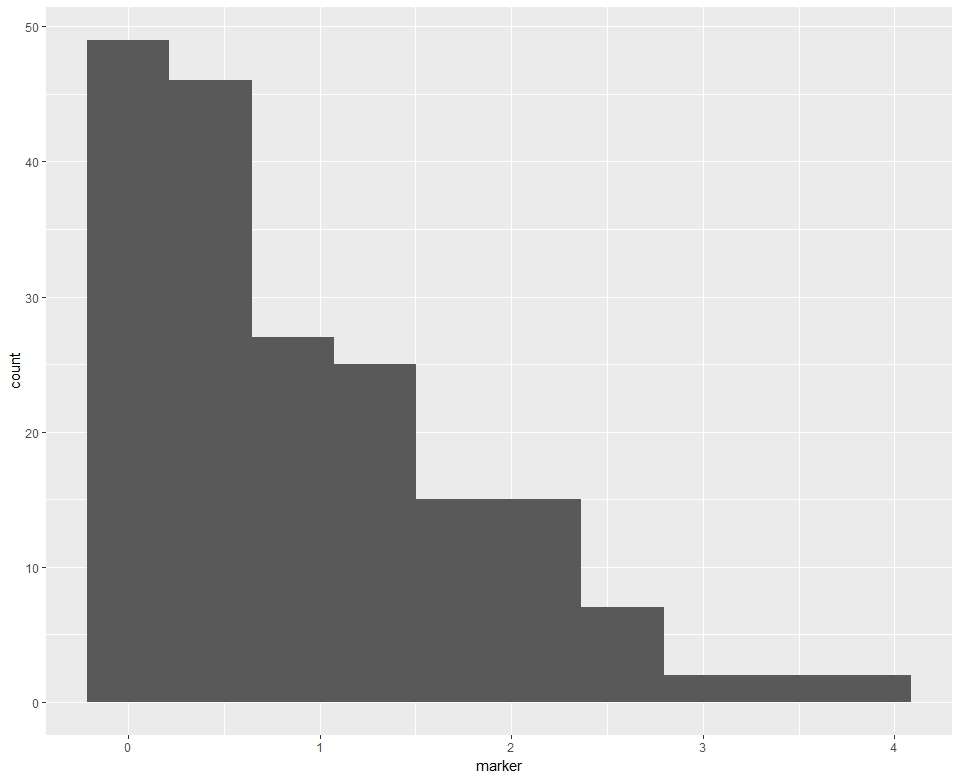
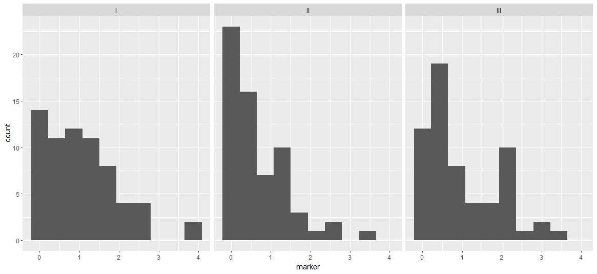
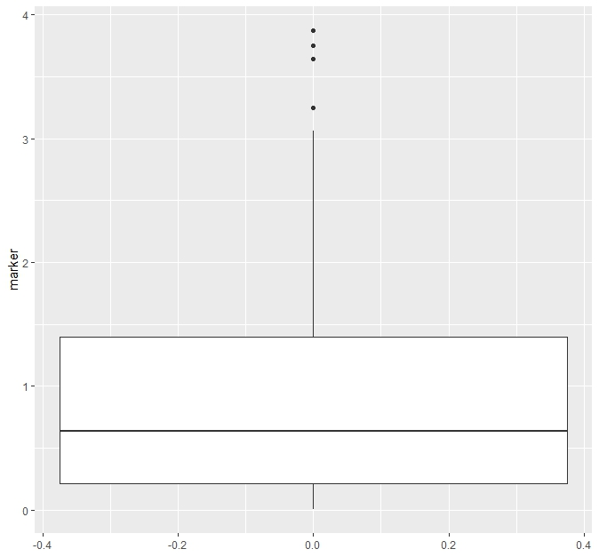
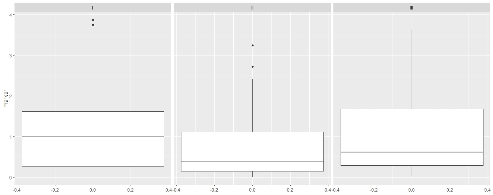
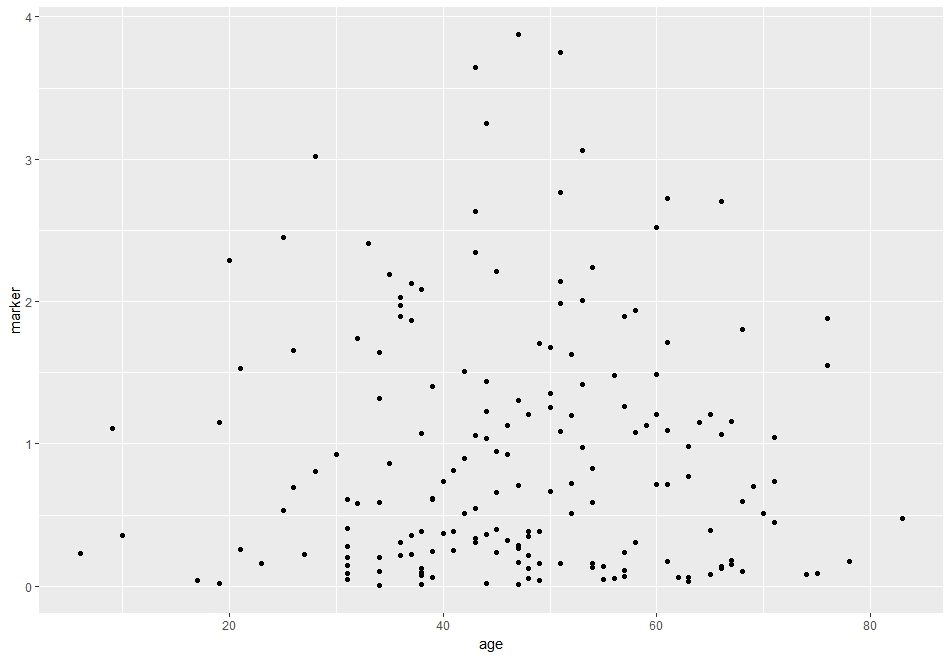

class: inverse, center, middle
# Plotting

---
# The {ggplot2} package for plotting

<p align="left"></p>

.large[

Plotting features are available in base R, but a very popular package for plotting in R is the {ggplot2} package, which will be the focus in this course. 

First install and load the {ggplot2} package:
]
  
```{r eval = FALSE}
install.packages("ggplot2")
```

```{r}
library(ggplot2)
```


---
# Setting up the plot basics

.large[
It is common to want to describe a continuous variable using a histogram, particularly to examine whether the distribution appears approximately normal.

We examine the variable "marker" in the `gtsummary::trial` dataset.

Build plots using {ggplot2} by first specifying the dataset and the basic aesthetics in a call to the `ggplot()` function.

So to create a basic histogram we start by specifying the dataset name "trial" and that we want to see the variable "marker" on the x-axis, this just creates the structure of the plot:
]

```{r eval = FALSE}
ggplot(data = trial, aes(x = marker))
```

---
# Adding a histogram layer

.large[
Add layers to the plot with "+" signs. 

Create the histogram by adding a layer with `geom_histogram()`:]

```{r eval = FALSE}
ggplot(data = trial, aes(x = marker)) + 
  geom_histogram()
```

---
# What do those warning messages mean?

```
`stat_bin()` using `bins = 30`. Pick better value with `binwidth`.
Warning message:
Removed 10 rows containing non-finite values (stat_bin). 
```

.large[
The first message, along with visual inspection, tells us the default number of bins is too many for this variable.

The other warning informs us that there are missing values in the variable "marker", which we will ignore for now, but in general this is an important warning.

Specify a smaller number of bins for the histogram using the `bins` argument to `geom_histogram()`:
]
  
```{r eval = FALSE}
ggplot(data = trial, aes(x = marker)) + 
  geom_histogram(bins = 10)
```


---
# Histogram interpretation

<p align="center"></p>

We find that the variable "marker" from the `trial` dataset has a positively skewed distribution.

---
# Histograms according to a categorical variable

.large[
What if it was of interest to see the distribution of marker according to disease grade?
  
Add a layer to our `ggplot()` using `facet_grid()` to get panels for each level of the disease grade variable "grade". 

Note that by default the y-axis and x-axis limits are fixed across all plots, so we can directly compare the distributions. It is possible to control this with the `scales` argument to `facet_grid()`, see `?facet_grid` for details. 
]

```{r eval = FALSE}
ggplot(data = trial, aes(x = marker)) + 
  geom_histogram(bins = 10) +
  facet_grid(cols = vars(grade))
```


---
# Histograms according to a categorical variable

<p align="center"></p>

---
# Boxplots

.large[
Boxplots are another common way of examining continuous variables. 

Now the continuous variable is on the y-axis instead of the x-axis as in the histogram case:
]

```{r eval = FALSE}
ggplot(data = trial, aes(y = marker))
```

.large[And the boxplot is created by adding a layer with `geom_boxplot()`:]

```{r eval = FALSE}
ggplot(data = trial, aes(y = marker)) + 
  geom_boxplot()
```

---
# Boxplot interpretation

.pull-left[
<p align="center"></p>
]

.pull-right[
.large[
The top and bottom of the box are the 25th and 75th quantiles.

The center line is the median.

The whiskers extend to 1.5xIQR.
]
]

---
# Boxplots according to a categorical variable

.large[
Now return our interest to the distribution of marker according to disease grade.

We see the syntax is identical to the histogram case:
]

```{r eval = FALSE}
ggplot(data = trial, aes(y = marker)) + 
  geom_boxplot() + 
  facet_grid(cols = vars(grade))
```

---
# Histograms according to a categorical variable

<p align="center"></p>


---
# Scatterplots

.large[
Scatterplots display the joint distribution of two continuous variables.

For example, what if we wanted to see a plot of "marker" by "age". 

Put age on the x-axis and marker on the y-axis 
]

```{r eval = FALSE}
ggplot(data = trial, aes(x = age, y = marker))
```

.large[Then the scatterplot is created by adding a layer with `geom_point()`:]

```{r eval = FALSE}
ggplot(data = trial, aes(x = age, y = marker)) + 
  geom_point()
```

---
# Scatterplot interpretation

<p align="center"></p>

.large[Look for increasing or decreasing trends, or clusters of points.]


---
# Exporting plots

.large[
We will often want to save plots to an external file to insert into a later document. 

There are several options:

1. Use the interactive plot window to export your created plot.

2. Use code to save your plot to an external location. There is a function called `ggsave()` specifically for saving results of `ggplot()`. By default it will save the last created plot, or you can save your plot to an object and specify it directly using the `plot` argument to `ggsave()`. You will specify the file format by including an extension, here ".png" on your filename.
]

---
# Saving from the interactive plot window

.large[Create your plot:]
```{r eval = FALSE}
ggplot(data = trial, aes(x = marker)) + 
  geom_histogram(bins = 10)
```


---
# Interactive saving options

.large[
Click on "Export" then select the option...
1. "Copy to Clipboard". This will open a pop-up window where you could rescale the plot, if desired, and then click "Copy Plot" to copy the plot to your clipboard so that you can paste it into any external document.
2. "Save as Image...". Here you can change the directory location where you want to save the plot to the same location where you have your code and data files for this class saved so far. You can select from a variety of file formats. Save it as "my-histogram" in PNG format. You can then insert this file into other documents as needed.
3. "Save as PDF..." and follow the same instructions as in B to save a .pdf version of your image.
    ]
    
---
# Save to file with the ggsave() function

```{r eval = FALSE}
p <- ggplot(data = trial, aes(y = marker)) + 
  geom_boxplot() + 
  facet_grid(cols = vars(grade))
    
ggsave(filename = "my-boxplot.png", 
       plot = p)
```

.large[
Can specify the whole filepath explicitly.

***Adjust the width and height using the `width` and/or `height` arguments to the `ggsave()` function***
]

