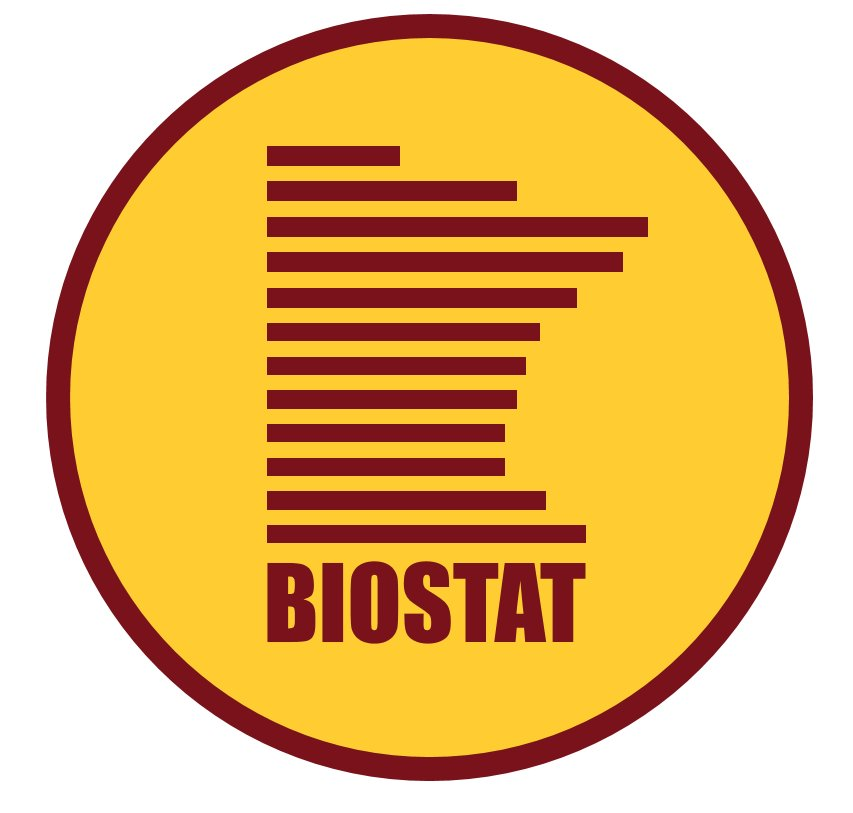

```{r setup, include=FALSE}
options(htmltools.dir.version = FALSE)
knitr::opts_chunk$set(
  fig.width=9, fig.height=3.5, fig.retina=3,
  out.width = "100%",
  cache = FALSE,
  echo = TRUE,
  message = FALSE, 
  warning = FALSE,
  hiline = TRUE
)
```

```{r xaringan-themer, include=FALSE, warning=FALSE}
library(xaringanthemer)
style_mono_accent(
  base_color = ezfun::ccf_palette("main")[1],
  colors = c(
    green = "#00843d"
  )
) 
```

class: inverse, center, title-slide, middle

# MMED501: Biostatistics and Epidemiology

## Introduction to R and RStudio

<br>

### Emily C. Zabor

#### May 12, 2022

<br>

<p align="center"></p>


---
# About me

.pull-left[
<p align="left"></p>

<p align="left"></p>

<p align="left"></p>

<p align="left"></p>
]

.pull-right[
.large[
MS in Biostatistics from the University of Minnesota

DrPH in Biostatistics from Columbia University

9 years as a Research Biostatistician in the Department of Epidemiology & Biostatistics at Memorial Sloand Kettering Cancer Center

Joined the Department of Quantitative Health Sciences & Taussig Cancer Institute as Assistant Staff in 2019
]
]


---
# About you

.pull-left[
.xxlarge[
- Name
- Undergrad/Grad school degrees
- Have you used R?
- How do you envision using R in the future
]
]

.pull-right[
<br>
<p align="center"></p>
]

---
```{r child='01-introduction-to-r.Rmd'}
```

---
```{r child='02-introduction-to-rstudio.Rmd'}
```

---
```{r child='03-introduction-to-rmarkdown.Rmd'}
```

---
```{r child='04-loading-data.Rmd'}
```

---
```{r child='05-plotting.Rmd'}
```

---
```{r child='06-descriptive-stats.Rmd'}
```


